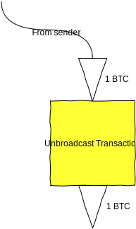
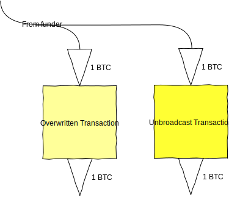
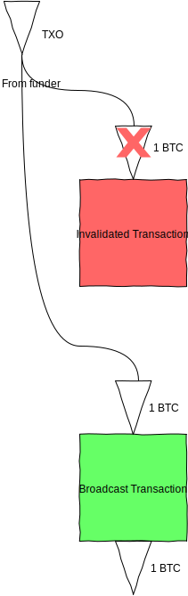
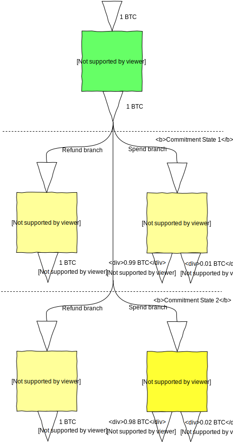
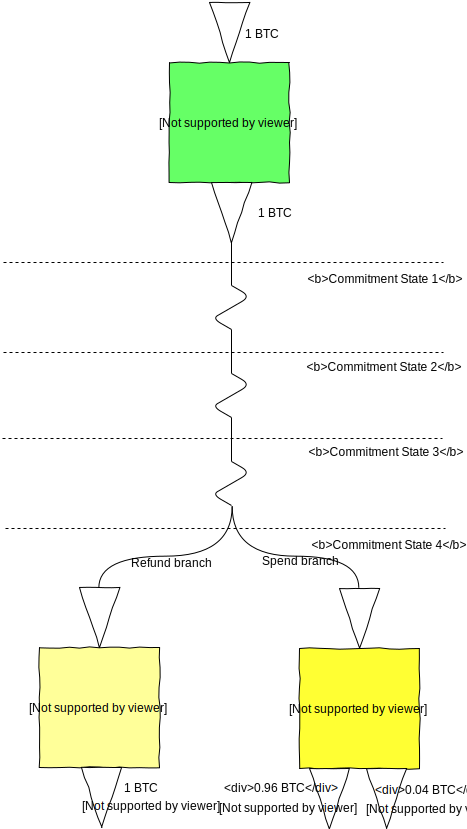

# Bitcoin Payment Channels, A Taxonomy

# Table of Contents

-  1 Introduction
-  2 A brief overview
-  3 Diagram style
    -  3.1 Transaction Graphs
        - Transaction types
    -  3.2 Message Exchange Diagrams
    -  3.3 Payment Channel Balance Diagrams
-  4 Simple Payment Channel
    -  4.1 Opening the channel
    -  4.2 Updating balances in the channel
    -  4.3 Redeeming a Commitment Transaction
    -  4.4 Exercising the Refund Branch
-  5 Two-way Channels
    -  5.1 Revocable Transactions
    -  5.3 Using sha-trees for efficient construcion and storage of revocation secrets
    -  5.2 Using revocable transactions to construct two-way payment channels
-  6 Everlasting Payment Channels
    -  6.1 Symmetric commitment states
    -  6.2 Opening an everlasting payment channel
    -  6.3 Updating the balance
    -  6.4 Re-anchoring the channel
    -  6.5 Closing the channel co-operatively
    -  6.6 Closing the channel unilaterally
-  7 Dual-funded payment channels
-  8 Acknowledgements

## 1. Introduction

This document is an attempt to describe the various kinds of payment channels that are possible in Bitcoin with today's technology. It is a top-to-bottom description of the payment channel and covers:

- the operation of the channel including the opening (*anchor*) transaction, the commitment states and the channel closing conditions
- the order and exchange of messages for commitment state changes
- the full locking (*scriptPubKey*) and unlocking (*scriptSig*) scripts for all transactions

The reader is assumed to have a knowledge of the format of bitcoin transactions and transaction outputs, the concept of pay-to-[witness-]script-hash and the workings of opcodes and the Script language. No prior knowledge of payment channels is assumed.

A few things this article doesn't cover:

- Applications of payment channels
- Historical constructions of payment channels (which have been obsoleted by newer opcodes)
- Anything outside the transaction layer that is required for a fully functioning lightning network (eg routing, message exchange, protocol for exchanging payment requests, etc)

This document is necessarily a work in progress. The rate of innovation in this area is extremely rapid, and new varieties of payment channels will most likely continue to be developed. Please direct any feedback to [@jonnynewbs](http://www.twitter.com/jonnynewbs) or raise a ticket against [the github repo](http://www.github.com/paychan/bitcoin-payment-channels-taxonomy).

With that, let's get started!

## 2. A brief overview

A payment channel is a sequence of valid Bitcoin transactions which are constructed, signed and exchanged off-chain by two counterparties. The transactions are not broadcast to the Bitcoin network during the operation of the channel, and only when one or both of the parties are ready to close the channel is a single closing transaction broadcast. This allows the balances between the two parties to be updated many times while only resulting in two transactions on the blockchain: one to open the channel and one to close the channel.

There are many reasons we'd want to do this:

- Each on-chain transaction requires miner transaction fees. Updating the balances within the payment channel and only settling to the blockchain when the channel closes means the parties don't have to pay Bitcoin transaction fees each time the balances are updated.
- Very small (micro) payments can be made within the channel. The Bitcoin network enforces a lower dust limit on transaction outputs, below which the transaction won't be relayed. Payment channel updates can change the balances in the channel by as little as 1 satoshi.
- Bitcoin transactions must be confirmed in at least one block before the recipient can be confident that the funds won't be double-spent. Blocks are mined on average every 10 minutes, so payments can take many minutes to be confirmed. In a payment channel, the funds are locked into the channel so the balances of both parties can be instantly updated with new commitment transactions within the channel.
- Bitcoin blocks have a size limit, which places a hard limit on the rate that the network can process transactions (currently around 7 transactions per second). Since payment channels only consume two on-chain transactions, using payment channels where there are lots of balance updates between two parties would allow the Bitcoin network to scale to many more transactions per second.

Payment channels exist as a sequence of *commitment states*. For a channel to be in a commitment state:

1. Both parties agree on their balances within the channel. This is the *consensus* property.
2. Either party can close out the channel unilaterally by broadcasting a transaction to claim their full balance (although they may need to wait for a timelock before doing so). This is the *escape* property.
3. As long as the parties monitor the blockchain and act correctly, neither can be denied their full balance. This is the *safeguard* property.

To update the balances in the channel, the channel goes through a *commitment state change* or *commitment transition* and enters a new commitment state with updated balances. A payment channel will always be in a commitment state or a commitment transition between two commitment states.

The *consensus* property guarantees that the channel remains synchronized between both parties and that the channel never enters a state where the parties' balances are confused. The *exit* property guarantees that at all times during channel's existence, both parties have an escape route to claim their balance. The *safeguard* property guarantees that by entering into a payment channel, neither party can be denied their full balance (so long as they act correctly).

Taken together, these properties ensure the trustless nature of the payment channel and mean that neither party takes on risk by entering into the channel.

## 3. Diagram style

#### 3.1 Transaction Graphs

Bitcoin transactions are collections of Transaction Inputs (TXIs) and Transaction Outputs (TXOs). The simplest Bitcoin transaction consists of a single TXI and a single TXO. The value of the TXO is equal to the value of the TXI (less the transaction fee):


A TXI is simply an unspent TXO (a UTXO) from a previous transaction, and the TXO from this transaction will go on to be a TXI in a future transaction. We can draw a chain of transactions as follows:


We're not interested in the transaction that funded our channel, just that it output a TXO which we use as our TXI. We also don't know how the TXO from our transaction will be spent until it's included as a TXI in a future transaction. Our standard transaction ends up looking like this:


Of course, most Transactions don't have just a single output. Here's an example transaction with two TXOs:


Finally, a single TXO can be spent in many ways. We can illustrate that with branching from the TXO:


This is slightly arbitrary, since the TXO could be spent in an infinite number of ways. However, it is instructive to see the different ways that we're expecting the TXO to be spent. In the following payment channels we'll be constructing many commitment transaction, each overriding the previous commitment transactions, so this notation will be useful.

##### Transaction types

If a transaction has been broadcast to the Bitcoin network, we'll colour it green:


We're not going to consider blockchain confirmations in this document. As with all Bitcoin transactions, users should wait for their transaction to be confirmed before building on top of it, but whether they actually do, and how many confirmations they wait for is an implementation decision. For the rest of the article we'll assume that all broadcast transactions are confirmed and will not be double-spent or invalidated.

If a transaction has been constructed and one party has a valid witness for the transaction, then we colour it yellow:



This transaction can be broadcast to the network (potentially after a locktime or relative locktime) by at least one party to close out the channel.

There may be several unbroadcast transactions using the same TXOs. We'll keep the most recent one coloured yellow, but the older transactions will be a lighter yellow to show that we're not expecting them to be used:



Once a transaction has a valid witness, that witness is valid forever. However, the transaction can be invalidated by creating and broadcasting a new transaction which double-spends the TXIs for the old transaction. We'll colour transactions that have been invalidated in this way red:



#### 3.2 Message Exchange Diagrams

Message exchange is depicted using standard ladder diagrams. As well as showing message exchange between the participants in a channel, the ladder diagram can also show one of the participants broadcasting a message to the blockchain:


In practice, when we show Alice broadcasting a 'signed transaction' to Bob within the channel, Alice may only be broadcasting a signature. As long as Bob knows what the transaction format should be, there's no need for Alice to send the full transaction to Bob.

#### 3.3 Payment Channel Balance Diagrams

Payment Channel Balance Diagrams are used to show the balance within a payment channel.

Alice and Bob start with their own funds of Bitcoin:


Alice funds a new payment channel with 20 BTC. Those funds are hers, but are temporarily locked in the payment channel. The balance of funds within the payment channel can move left and right as the parties create and exchange new commitment transactions:


Alice then pays 10 BTC to Bob within the channel. The channel now contains a balance of 10 BTC for Alice and 10 BTC for Bob:


Alice continues to pay Bob in the channel until her balance is 5 BTC and his balance is 15 BTC:


Finally, Alice closes out the channel, freeing up 5 BTC for herself and 15 BTC for Bob:


## 4. Simple Payment Channel

This is the simplest form of Payment Channel. It is **One-way**, **Simplex** or **Unidirectional**, which means that funds can only flow in one direction from payer to recipient. It is also **Fixed-duration**, which means that the payment channel has to be closed out with a *closing transaction* before a fixed expiry time. If the payer wishes to continue paying the recipient through a channel after this time, she must open a fresh payment channel with a new *anchor transaction*.

As is tradition, Alice is the payer and Bob is the recipient. Alice wishes to pay Bob in increments of 0.01 BTC up to a maximum of 1 BTC.

#### 4.1 Opening the channel

To open the channel, Alice constructs and signs an anchor transaction and then broadcasts it to the Bitcoin network. The anchor transaction has a single TXO which can be spent either:

1. with both Bob and Alice's signatures. This is the *spend* branch; or
2. with Alice's signature after a channel expiration duration (eg 24 hours). This is the *refund* branch.


Alice needs a refund branch to protect her funds from being stranded in the channel. This is required for the fundamental *escape* property of channels - both parties must have an escape route to reclaim their funds at all times in the channel's existence. If the anchor transaction didn't have a refund branch and was just a 2-of-2 multisig, then Alice wouldn't have an escape route.

Without an escape route Alice's funds could become stranded or held to ransom inside the channel. If Bob stops responding to Alice's messages (either inadvertently or maliciously), Alice would have no way to get her funds back. A malicious Bob might hold Alice's funds to ransom and only agree to unlock the multisig TXO in return for a ransom fee.

The locking script is as follows:

```
OP_IF
  <Bob's public key> OP_CHECKSIGVERIFY # Spend branch - requires both signatures
OP_ELSE
  <channel expiry duration> OP_CHECKSEQUENCEVERIFY OP_DROP # Refund branch - after the channel expiry duration only Alice's signature is required
OP_ENDIF
<Alice's public key> OP_CHECKSIG # Both branches require Alice's signature
```

To finish opening the channel, Alice constructs the first *commitment transaction* (*CTx1*) and sends it directly to Bob. This transaction has the anchor transaction TXO as its only TXI, and produces two TXOs:

- TXO1 is for 0.01 BTC and can be spent with Bob's signature
- TXO2 is for 0.99 BTC and can be spent with Alice's signature

Both of those TXOs can be standard P2PKHs.

We're now in commitment state 1:


Let's check the commitment state properties:

1. Both parties agree that Alice's balance is 0.99 BTC and Bob's balance is 0.01 BTC.
2. Both parties have an escape route: Alice can escape by broadcasting her refund transaction and claiming 1 BTC (after the channel expiry duration), and Bob can escape by signing and brodcasting CTx1 and claiming his 0.01 BTC.
3. Both parties are guaranteed their full balance: Alice gets at least 0.99 BTC in both escape paths. Bob can guarantee he'll get 0.01 BTC by broadcasting CTx1 before Alice broadcasts the refund transaction. To make sure this happens, he just needs to broadcast the CTx well before the channel expiry duration.

#### 4.2 Updating balances in the channel

Let's assume that Bob hasn't closed out the channel and Alice wants to pay a further 0.01 BTC to Bob. She constructs and signs a second commitment transaction CTx2 and sends it to Bob. This second transaction has exactly the same anchor transaction TXO as its TXI, but now produces the following TXOs:

- TXO1 is for 0.02 BTC and can be spent with Bob's signature
- TXO2 is for 0.98 BTC and can be spent with Alice's signature

Commitment state 2 looks like this:



In effect, this is a double-spend of the anchor transaction TXO, so only one of those transactions can be included in the blockchain.

Let's check the commitment state properties again:

1. Both parties now agree that Alice's balance is 0.98 BTC and Bob's balance is 0.02 BTC.
2. Both parties have an escape route: Alice can escape by broadcasting her refund transaction and claiming 1 BTC (after the channel expiry duration), and Bob can escape by signing and brodcasting one of the CTxs. He'll almost certainly prefer the transaction which gives him 0.02 BTC, so he can throw away CTx1 as soon as he receives CTx2.
3. Both parties are guaranteed their full balance: Alice gets at least 0.98 BTC in both escape paths. Bob can guarantee he'll get 0.02 BTC by broadcasting CTx2 (and not broadcasting CTx1!), and making sure CTx2 is broadcast before Alice broadcasts the refund transaction. Alice doesn't have Bob's signature for any of the CTxs, so can't broadcast an old CTx that pays Bob a lower balance.

Alice can continue paying Bob through the payment channel in this fashion. Each time she wants to pay another 0.01 BTC to Bob, she constructs a new CTx from the same anchor transaction output and sends it to Bob.



There are two ways to close the channel:

1. Bob signs and broadcasts a CTx.
2. The channel expires and Alice broadcasts the RTx.

The advantage of this style of payment channel is that it is extremely simple. The anchor TXO locking script is essentially either a 2-of-2 multisig in the spend branch, or a P2PKH with relative timelock in the refund branch. Commitment transitions are achieved simply by Alice constructing and signing new CTXs and sending them to Bob.

The channel is also almost entirely passive from Bob's point of view. He simply needs to keep hold of the most recent CTx, and then sign and broadcast it when he's ready to close the channel. Simple channels should be very straightforward for wallets and applications to implement.

#### 4.3 Closing the channel by redeeming a commitment transaction

Bob could sign and broadcast his latest CTx to close the channel for a couple of reasons:

1. Alice has paid exhausted her funds in the channel (ie the most recent CTx sends 1 BTC to Bob and 0 to Alice).
2. Bob simply wishes to close out the channel and collect his balance from the most recent CTx.

In either case, he should make sure he signs and broadcasts the most recent CTx well before Alice does, to make sure the RTx doesn't steal the TXIs for his CTx.

Here's a diagram of Bob closing the channel after 4 commitment transactions:


In this example:

1. Alice broadcasts the Anchor transaction to the network
2. Alice then constructs and signs a sequence of four CTxs, which she sends to Bob
3. Bob closes the channel by signing and broadcasting the most recent transaction CTx4

Bob broadcasts CTx4 transaction, which has the following unlocking script:

```
<Alice's sig> <Bob's sig> 1
```

#### 4.4 Closing the channel by exercising the refund branch

Bob should never let the channel expiry time pass without broadcasting a CTx. Once the channel is expired, Alice is able to broadcast the RTx and reclaim all the funds in the channel.

However, if Bob stops responding, Alice needs a way to reclaim the funds from the channel. She does this by constructing and broadcasting a refund transaction.

Here's a diagram of Bob disappearing after 2 CTxs, and Alice reclaiming the funds with an RTx:


The refund transaction takes the anchor transaction TXO as its TXI and has the following unlocking script:

```
<Alice's sig> 0
```

## 5. Two-way Channels

One of the most obvious limitations of the simple payment channel is that it is one-way. Bob's balance in the channel can only ever increase, and Alice's balance can only ever decrease. This is because every commitment transaction that Alice signs and sends to Bob is valid forever (at least until one of them is broadcast and confirmed). Even if Alice constructs and signs a new transaction with a smaller balance for Bob, Bob will always be able to broadcast the commitment transaction which assigns him the greatest balance. Alice has no way to stop Bob from doing this, and no way to invalidate the old commitment trasactions.

However, there is a trick that allows Alice to ensure that Bob can't use a previous commitment transaction to claim an old balance. This trick uses hash pre-images and timelocks to construct a *revocable* transaction. That's what we'll look at next.

#### 5.1 Revocable Transactions

The trick to creating revocable transactions is to construct one of the TXOs such that it is either encumbered by:

- Bob's signature and a relative timelock (Bob's *spend branch*); or
- Alice's signature and a secret revocation hash provided by Bob (Alice's *revocation branch*).

To revoke the transaction, Bob reveals the pre-image of his secret revocation hash to Alice. If Bob ever broadcasts the revoked transaction, then Alice will have the chance to spend before him (since his spend branch is encumbered by a timelock and Alice's isn't). Bob is effectively blocked from being able to use the revoked transaction.

We'll call this type of TXO a *revocable TXO* or *rTXO* for short. The secret revocation hash is *h(rev)* and its pre-image is *rev*.


Transactions will normally have multiple TXOs. Within a payment channel, there will be one TXO for Alice's balance and an rTXO for Bob's balance (which can be spent by Alice when the rTXO is revoked):


Once Bob has revealed the revocation secret, he's no longer able to broadcast the revocable transaction since Alice would be able to collect her spend TXO as well as the rTXO. The transaction has been revoked:


We're going to use rTXOs *a lot* for more advanced channels, so it makes sense to have a special notation for them:


Conceptually, the combined up/down facing chevron indicates that the rTXO can be revoked.

The locking script for a revocable transaction is:

```
OP_IF # Bob's spend branch - after the revocation timeout duration, Bob can spend with just his signature
  <TXO revocation timeout duration> OP_CHECKSEQUENCEVERIFY OP_DROP
  <Bob's public key>
OP_ELSE # Revocation branch - once the revocation pre-image is revealed, Alice can spend immediately with her signature
  OP_HASH160 <h(rev)> OP_EQUALVERIFY OP_DROP
  <Alice's public key>
OP_ENDIF
OP_CHECKSIG
```

For Bob to spend the TXO, he needs to wait for the revocation timeout duration and then provide the following unlocking script:

```
<Bob's sig> 1
```

If Bob broadcasts a revoked transaction, Alice can claim the revocation TXO by providing the following unlocking script:

```
<Alice's sig> <rev> 0
```
#### 5.2 Using sha-trees for efficient generation and storage of revocation secrets.

The revocation hash is the 160 bit image of hashing a secret revocation pre-image first with SHA256 and then with RIPEMD-160. Bob needs to make sure that Alice can't guess the pre-images for the revocation hashes. If she could do that, then she'd be able to steal the funds from the rTXO before Bob had revoked it.

The simplest way for Bob to create revocation secrets would be to use a pseudo-random number generator every time he needed to provide Alice with a new revocation hash. However, we're going to use revocation secrets in channels where we expect a large number of CTxs. Alice needs to store all the revocation secrets to ensure Bob doesn't broadcast an old revoked transaction, and the space required for Alice to store those pre-images would grow linearly with the number of commitment transactions in the channel.

Much better is if Bob uses a seed to generate the revocation secrets, and then shares information with Alice that would allow her to generate all the revocation pre-images that have been revealed so far.

One way to do this would be to use a sha-chain. Take a random seen and run SHA256 on it 1,000,000 times. Use the 1,000,000th hash as the first revocation pre-image, the 999,999th hash as the second pre-image and so on. Alice only needs to store the most recent pre-image, since she can derive all the other pre-images by hashing it repeatedly. The downside to this is that Bob needs to hash a value 1,000,000 times when the channel opens, and then either:

- store all 1,000,000 values (which is what we're trying to avoid!); or
- hash the same seed 999,999 times for the next revocation pre-image, and then hash the seed 999,998 times for the next, and so on.

That's slow and computationally expensive.

Better is to use a seed to construct an efficient binary tree of revocation secret. The method for constructing and storing the sha-tree is described in https://github.com/rustyrussell/ccan/blob/master/ccan/crypto/shachain/design.txt.

Using this method:

- Bob can generate up to 2^64 - 1 revocation pre-images from a single 256-bit seed
- Bob has to do a maximum of 63 hashes, and an average of 1 hash, to generate a new revocation pre-image
- The number of revocation pre-images that Alice needs to store grow O(log n) with the number of transactions

#### 5.3 Using revocable transactions to construct two-way payment channels

To create a two-way payment channel, Bob first needs to provide two revocation hashes *h(rev1)* and *h(rev2)* to Alice. Alice then constructs the anchor transaction exactly as before. The ATx's TXO can be spent either by a 2-of-2 multi-sig or by just herself after the channel expiry duration.

Alice completes the channel opening by constructing and signing CTx1 and sending it to Bob. The difference from the one-way payment channel is in the construction of the CTxs: instead of including a standard P2PKH for Bob's TXO, she uses a rTXO with a revocation hash *h(rev1)* provided by Bob.

The message exchange for channel opening is:


Commitment state 1 is as follows:


If Alice then wants to increase Bob's balance in the channel to 0.02 BTC, she constructs a new CTx which sends 0.98 BTC to herself and 0.02 BTC to Bob. The only difference from a simple channel is that the TXO for Bob in the CTx is an rTXO. Alice uses the second revocation hash *h(rev2)* to construct CTx2.

To acknowledge and commit the new CTx, Bob sends the revocation secret for CTx1 *rev1* along with a new revocation hash *hash(rev3)* so Alice can construct CTx3.

The message exchange for the first channel payment from Alice to Bob is:


Commitment state 2 is:


Strictly speaking, Alice could use re-use the previous revocation hash to construct CTx2. That's because Alice only needs Bob to revoke an old CTx if her balance in the new CTx has increased. She doesn't need to revoke CTx1 (which gives her 0.99 BTC) since she'd be perfectly happy for Bob to broadcast CTx1 instead of CTx2 (which gives her 0.98 BTC).

However, we're not going to use that optimization. It makes things simpler just to use a new revocation secret for each new CTx. The sha-tree described in section 5.2 means that additional revocation secrets are cheap to generate and store, so the slight additional overhead in using unnecessary revocation hashes is acceptable for keeping the protocol simple.

Bob now wants to pay Alice 0.01 BTC and reduce his balance in the channel back to 0.01 BTC. Bob sends a request to Alice to create a new CTx with the new channel balances. Alice then constructs and signs CTx3 using *h(rev3)* and sends it to Bob. As before, Bob revokes the previous transaction and provides Alice with a new revocation hash.

The message exchange for Bob's channel payment to Alice is:


Commitment state 3 is:


Bob can close the channel as soon as the rTXO timeout duration has elapsed by signing and broadcasting the most recent CTx.

Bob needs to make sure that he is able to close the most recent CTx well before Alice is able to broadcast RTx. Since the CTxs are encumbered by an rTXO timeout, in effect Bob needs to stop revoking old CTxs well before the channel expiry time.

## 6. Everlasting Payment Channels

So far, we've seen how to construct one-way and two-way payment channels. However, we're still limited by the channel expiry duration, which is determined by the relative locktime on Alice's refund branch. This means that our payment channels can only be open for a certain period of time before the channel has to be closed by Bob.

Next we'll look at how to construct a payment channel that can stay open indefinitely.

#### 6.1 Symmetric commitment states

Payment channels have two branches. So far, the payment channels we've seen have a *spend* branch for Bob and a *refund* branch for Alice. The refund branch is required to prevent Alice's funds from being stranded (Alice's *escape* clause), and needs to have a relative timelock to prevent Alice from stealing all the funds in the channel (Bob's *safeguard* clause).

With revocable transactions, we have a new method of preventing funds from being stranded inside the transaction. Instead of Alice's branch being a refund transaction, we can create a mirror image of Bob's branch, with the revocable transaction ensuring that the funds don't get stranded. Either party can close out the channel with their most recent commitment transaction, so there's no longer any need for a refund branch.

#### 6.2 Opening an everlasting payment channel

The anchor transaction for a symmetric payment channel is simply a 2-of-2 multisig transaction. Alice's branch is no longer a refund branch, but a mirror of Bob's spend branch, so the anchor transaction TXO doesn't need a relative locktime refund branch for Alice. All CTxs in the channel are the same as for the two-way channel, but are constructed as pairs - CTxA is constructed and signed by Alice and CTxB is constructed and signed by Bob.

Alice needs to be a bit careful in opening the payment channel. If she just pays into a multisig address, then her funds could be stranded if Bob disappears. Therefore, the sequence for opening a symmetric transaction is as follows:

1. Alice constructs an anchor transaction to a 2-of-2 multisig address for Alice and Bob, but she doesn't broadcast or share it.
2. Alice sends the unsigned ATx to Bob, along with her first two revocation hashes h(revA1) and h(revA2).
3. Bob constructs his first commitment transaction CTxB1 using h(revA1) and sends it to Alice, along with his first two revocation hashes h(revB1) and h(revB2).
4. Alice verifies that CTxB1 is correct, then constructs her first commitment transaction CTxA1 using h(revB1) and sends it to Bob.
5. Alice signs and broadcasts the anchor transaction.


Commitment state 1 is as follows:


We're now in a commitment state. Either party is able to close the channel and claim their full balance (after the revocation timeout).

#### 6.3 Updating the balance

If Alice wants to pay Bob in the channel, she needs to transition the channel to a new commitment state with an increased balance for Bob. She does this as follows:

1. Alice constructs a new commitment transaction CTxA2 with the new balances and using h(revB2) and sends it to Bob.
2. Bob constructs a new commitment transaction CTxB2 with the new balances and h(revA2) and sends it to Alice. He also sends revB1 to revoke the previous CTxA and hash(revB3) so Alice can construct the next CTxA.
3. Alice sends revA1 to Bob to revoke CtxB1, and hash(revA3) so Bob can construct the next CTxB.


Commitment state 2 is as follows:


If Bob wants to pay Alice in the channel, the protocol proceeds exactly as above, except that the roles are reversed (ie Bob starts by constructing a new CTxB and sending it to Alice).

#### 6.4 Re-anchoring the channel

Since there is no refund transaction in this type of channel, it's possible for the parties to co-operate to add fresh funds to the payment channel or withdraw funds from the payment channel without closing it.

If one party runs out of funds in the channel, they may want to recharge the payment channel with additional funds (one blockchain transaction) rather than close the channel and open a new channel (two transactions).

Let's assume Alice wants to add funds to the channel. The process is as follows:

1. Alice constructs and signs a second anchor transaction ATx2 to the 2-of-2 multisig address for Alice and Bob, but she doesn't broadcast or share it. The TXIs for ATx2 are the TXO from ATx1 and a new TXI from Alice for the recharge amount.
2. Alice sends the txid (the hash of the transaction) to Bob, along with a new revocation hash h(revA2-1).
3. Bob constructs a new commitment transaction CTxB2-1 as follows:
    - The TXI is the TXO from ATx2
    - Bob's balance is the same is it was in the previous CTx
    - Alice's balance is her balance from the previous CTx plus the additional funds she's just paid into the channel with ATx2
    - the revocation hash is h(revA2-1)
4. Bob sends CTxB2-1 to Alice, along with a new revocation hash h(revB2-1).
5. Alice constructs her first commitment transaction CTxA2-1. This is the mirror of Bob's commitment transaction CTxB2-1.
6. Alice broadcasts ATx2 to the Bitcoin network
7. Alice sends the revocation pre-image from the previous CTxA to Bob.
8. Bob sends the revocation pre-image from the previous CTxB to Alice.

Withdrawals can be made in a similar way. If Alice wants to withdraw funds from the channel:

1. Alice constructs and signs a second anchor transaction ATx2, but she doesn't broadcast or share it. The TXI for ATx2 is the TXO from ATx1 and a new TXI from Alice for the recharge amount. There are two TXOs: one which pays into the 2-of-2 multisig (for the channel), and one which pays to Alice.
2. Alice sends the txid (the hash of the transaction) to Bob, along with a new revocation hash h(revA2-1).
3. Bob constructs a new commitment transaction CTxB2-1 as follows:
    - The TXI is the first TXO from ATx2
    - Bob's balance is the same is it was in the previous CTx
    - Alice's balance is her balance from the previous CTx minus the funds she's just withdrawn from ATx1
    - the revocation hash is h(revA2-1)
4. Bob sends CTxB2-1 to Alice, along with a new revocation hash h(revB2-1).
5. Alice constructs her first commitment transaction CTxA2-1. This is the mirror of Bob's commitment transaction CTxB2-1.
6. Alice broadcasts ATx2 to the Bitcoin network
7. Alice sends the revocation pre-image from the previous CTxA to Bob.
8. Bob sends the revocation pre-image from the previous CTxB to Alice.

Paying into the payment channel (from one side) and withdrawing from the payment channel (to the other side) is a quick way to rebalance a payment channel that has become unbalanced.


#### 6.5 Closing the channel co-operatively

If both parties agree that they want to close the channel, they can close it immediately without having to wait for the revocation timeout delay. If Alice wants to close the channel co-operatively, she constructs a *closing transaction* as follows:

1. the TXI is the TXO from the anchor transactions
2. there are two TXOs:
    - a P2PKH to Alice for her balance (from the current commitment state)
    - a P2PKH to Bob for his balance (from the current commitment state)

she signs the transaction and sends it to Bob, who also signs it and broadcasts it to the Bitcoin network:


Bob can close the channel co-operatively in exactly the same way, since the channel is entirely symmetrical.

If Alice constructs and sends the closing transaction to close the channel co-operatively but Bob doesn't broadcast it to the network, Alice **must** close the channel unilaterally and should not sign any more commitment transactions. This is because Alice cannot revoke the closing transaction, so Bob might keep hold of it and broadcast it after his balance has decreased.

#### 6.6 Closing the channel unilaterally

In any commitment state, both parties hold a valid CTx. Either party can close out the channel by broadcasting the CTx after waiting for the revocation timeout duration.


## 7. Dual-funded payment channels

So far, all of the payment channels that we've seen have been wholly funded by Alice. We now have a method of opening a payment channel that's funded by both parties:

1. Alice opens the payment channel as normal with her funds.
2. Alice and Bob co-operate to re-anchor the payment channel using Bob's funds as an additional input.


## 8. Acknowledgements and further reading

Many people have contributed ideas to the concept of bitcoin payment channels. The list below aims to identify ideas that have been particularly important in that development. There's no doubt that I'll fail to acknowledge everyone. Please contact [@jonnynewbs](http://www.twitter.com/jonnynewbs) or raise a ticket against [the github repo](http://www.github.com/paychan/bitcoin-payment-channels-taxonomy) if you believe there to be any egregious omissions.

- Simple payment channels were suggested for bitcoin as long ago as 2012. There's [a page on the bitcoin wiki](https://en.bitcoin.it/wiki/Contract#Example_7:_Rapidly-adjusted_.28micro.29payments_to_a_pre-determined_party) which describes a (pre-OP_CHECKSEQUENCEVERIFY) method for creating a payment channel. The page was written by Mike Hearn, with credit for ideas given to Nick Szabó in his paper [Formalizing and Securing Relationships on Public Networks](http://szabo.best.vwh.net/formalize.html).
- Mike Hearn and Matt Corallo implemented payment channels in [bitcoinj](https://bitcoinj.github.io/).
- The ideas of revocable transactions, symmetric commitment transactions and hashed time-locked contracts were introduced by Joseph Poon and Thaddeus Dryja in their paper [The Bitcoin Lightning Network](https://lightning.network/lightning-network-paper.pdf).
- Rusty Russell wrote [an illuminating set of blog posts](http://rusty.ozlabs.org/?p=450) describing the concepts behind the lightning network. Note that many of the specific techniques described in the posts have been obsoleted by the newer OPCODEs and segwit.
- Rusty has also written the first two [BOLTs (Basis of Lightning Technology)](https://github.com/rustyrussell/lightning-rfc/tree/master/bolts) and the [spec for sha-trees](https://github.com/rustyrussell/ccan/blob/master/ccan/crypto/shachain/design.txt).
- The lightning-dev [mailing list](https://lists.linuxfoundation.org/pipermail/lightning-dev/) and [IRC channel](https://botbot.me/freenode/lightning-dev/) are great sources of information.
- There are a number of lightning implementations in development:
    - [lightningd by Blockstream](https://github.com/ElementsProject/lightning/)
    - [lnd by lightningnetwork](https://github.com/LightningNetwork/lnd)
    - [Thunder by Blockchain.info](https://github.com/blockchain/thunder)
    - [Eclair by ACINQ](https://github.com/ACINQ/eclair)
    - [Amiko-pay](https://github.com/cornwarecjp/amiko-pay)