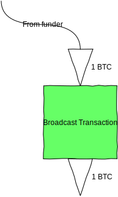
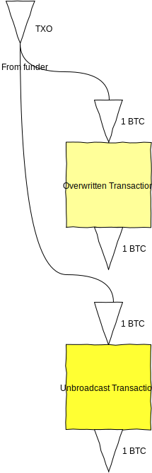
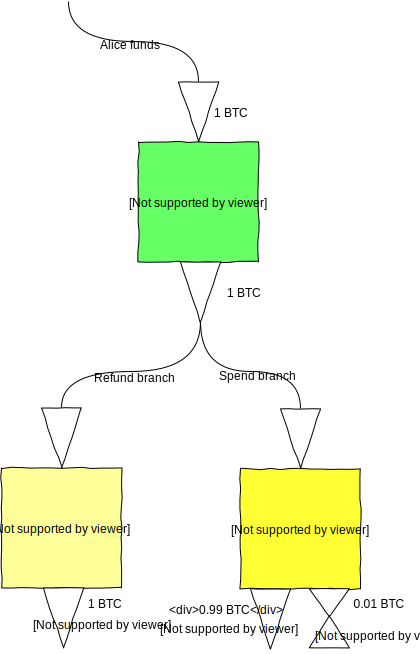
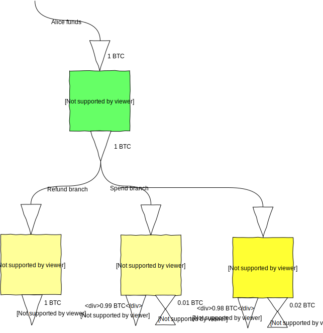
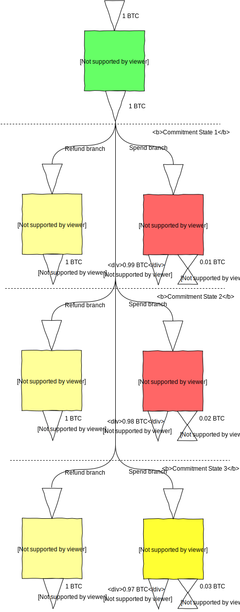

# Bitcoin Payment Channels, A Taxonomy

## Introduction

This document is an attempt to describe the various kinds of payment channels that are possible in Bitcoin with today's technology. It is a top-to-bottom description of the payment channel and covers:

- the operation of the channel including the opening (*anchor*) transaction, the commitment states and the channel closing conditions
- the order and exchange of transactions for commitment state changes
- the full locking (*scriptPubKey*) and unlocking (*scriptSig*) scripts for all tranactions.

The reader is assumed to have a knowledge of the format of bitcoin transactions and transaction outputs, the concept of pay-to-[witness-]script-hash and the workings of opcodes and the Script language. No prior knowledge of payment channels is assumed.

A few things this article doesn't cover:

- Applications of payment channels
- Historical constructions of payment channels (which have been obsoleted by newer opcodes)
- Anything outside the transaction layer that is required for a fully functioning lightning network (eg routing, message exchange, payment protocol for exchanging payment requests, etc)

This document is necessarily a work in progress. The rate of innovation in this area is extremely rapid, and new varieties of payment channels will most likely continue to be developed. Please direct any feedback to [@jonnynewbs](http://www.twitter.com/jonnynewbs).

With that, let's get started!

## A brief overview

A payment channel is a series of Bitcoin transactions which are constructed, signed and exchanged off-chain by two counterparties, and only brodcast to the Bitcoin network (and therefore included in the blockchain) once the parties are ready to close the channel. This allows the balances between the two parties to be updated many times while only resulting in two transactions on the blockchain: one to open the channel and one to close the channel. There are many reasons we'd want to do this:

- Each on-chain transaction requires miner transaction fees. Updating the balances within the payment channel and only settling to the blockchain when the channel closes means the parties don't have to pay Bitcoin transaction fees each time the balances are updated.
- Very small (micro) payments can be made within the channel. The Bitcoin network enforces a lower dust limit on transaction outputs, below which the transaction won't be relayed. Payment channel updates can change the balances in the channel by as little as 1 satoshi.
- Bitcoin transactions must be confirmed in at least one block before the recipient can be confident that the funds won't be double-spent. Blocks are mined on average every 10 minutes, so payments can take many minutes to be confirmed. In a payment channel, the funds are locked into the channel so the balances of both parties can be instantly updated with new commitment transactions within the channel.
- Bitcoin blocks have a size limit, which places a hard limit on the number of transactions the network can process per second (currently around 7 transactions per second). Since payment channels only consume two on-chain transactions, using payment channels where there are lots of balance updates between two parties would allow the Bitcoin network to scale to many more transactions per second.

Payment channels exist as a sequence of *commitment states*. For a channel to be in a commitment state:

- both parties agree on their balances within the channel
- either party can close out the channel unilaterally by broadcasting a transaction to claim their full balance (although they may need to wait for a timelock before doing so)
- as long as the parties monitor the blockchain and act correctly, neither can be denied their full balance.

To update the balances in the channel, the channel goes through a *commitment state change* or *commitment transition* and enters a new commitment state with updated balances. A payment channel will always be in a commitment state or a commitment transition between two commitment states.

Since either party can always close the channel and claim the full balance, neither takes on any risk or requires any trust in the counterparty.

## Diagram style

Bitcoin transactions are collections of Transaction Inputs (TXIs) and Transaction Outputs (TXOs). The simplest Bitcoin transaction consists of a single TXI and a single TXO. The value of the TXO is equal to the value of the TXI (less the transaction fee):


A TXI is simply an unspent TXO (a UTXO) from a previous transaction, and the TXO from this transaction will go on to be a TXI in a future transaction. We can draw a chain of transactions as follows:


We're not interested in the transaction that funded our channel, just that it output a TXO which we use as our TXI. We also don't know how the TXO from our transaction will be used until it's included as the TXI in a future transaction. Our standard transaction ends up looking like this:


Of course, most Transactions don't have just a single output. Here's an example transaction with two TXOs:


Finally, a single TXO can be spent in many ways. We can illustrate that with branching from the TXO:


This is slightly arbitrary, since the TXO could be spent in an infinite number of ways. However, it is instructive to see the different ways that we're expecting the TXO to be spent. This is important when we're constructing transactions within a payment channel, each of which may be overriding the previous transaction.

#### Transaction types

If a transaction has been broadcast to the Bitcoin network, we'll colour it green:



We're not going to worry about confirmations in blocks. Obviously users should wait for their transaction to be confirmed before building on top of it, but whether they actually do, and how many confirmations they wait for is an implementation decision.

If a transaction has been constructed and one party has a valid witness for the transaction, then we colour it yellow:


This transaction can be broadcast to the network (potentially after a locktime or relative locktime) by at least one party to close out the channel.

There may be several unbroadcast transactions using the same TXOs. We'll keep the most recent one coloured yellow, but the older transactions will be a lighter yellow to show that we're not expecting them to be used:



Once a transaction has a valid witness, it is valid forever. However, it can be invalidated by creating and broadcasting a new transaction which uses the same TXOs that were the TXIs for the old transaction. We'll colour transactions that have been invalidated in this way red:


## Simple Payment Channel

This is the simplest form of Payment Channel. It is **One-way**, **Simplex** or **Unidirectional**, which means that funds can only flow in one direction from payer to recipient. It is also **Fixed-duration**, which means that the payment channel has to be closed out with a *closing transaction* after a fixed time period. If the payer wishes to continue paying the recipient through a channel after this time, she must open a fresh payment channel with a new *anchor transaction*.

As is tradition, Alice is the payer and Bob is the recipient. Alice wishes to pay Bob in increments of 0.01 BTC up to a maximum of 1 BTC.

### Opening the channel

The Channel is opened with an anchor transaction, which is constructed and signed by Alice, and broadcast to the Bitcoin network. The anchor transaction has a single transaction output which can be spent either:

1. with both Bob and Alice's signatures. This is the *spend* branch; or
2. with Alice's signature after a channel expiration duration (eg 24 hours). This is the *refund* branch.


Alice is providing all of the funds for the channel. The refund branch protects Alice from having those funds stranded or held to ransom inside the channel. The spend branch requires Bob's signature, so if there was no refund branch Bob could stop responding and Alice would have no way of reclaiming her funds. If Bob were malicious, he might hold Alice's funds to ransom and only agree to sign a transaction from the anchor transaction if it assigned the majority of funds to him.

The locking script is as follows:

```
OP_IF
  <Bob's public key> OP_CHECKSIGVERIFY # Spend branch - requires both signatures
OP_ELSE
  <channel expiry duration> OP_CHECKSEQUENCEVERIFY OP_DROP # Refund branch - after the channel expiry duration only Alice's signature is required
OP_ENDIF
<Alice's public key> OP_CHECKSIG # Both branches require Alice's signature
```

Before using the channel, the anchor transaction must be confirmed in the blockchain. If it isn't confirmed and Bob starts accepting payments through the channel, then Alice could double-spend the input to the anchor transaction and Bob would be left with nothing.

As things stand, Alice can claim her refund after the channel expiry duration by broadcasting the refund transaction. We'll refer to this as commitment state 0:


#### Paying into the channel

Alice now wishes to update Bob's balance to be 0.01 BTC. To do this, she must move the channel into a new commitment state. She constructs and signs the first *commitment transaction* and sends it directly to Bob. This transaction has the anchor transaction output as its only input, and produces two outputs:

- TXO1 is for 0.01 BTC and can be spent with Bob's signature
- TXO2 is for 0.99 BTC and can be spent with Alice's signature

Both of those outputs can be standard P2PKHs. This is a valid Bitcoin transaction, and has been signed by Alice. Remember that the anchor transaction output required both Alice's and Bob's signatures, and Bob hasn't signed this transaction, so Alice doesn't have a full witness. The transaction can't be brodcast to the Bitcoin network until Bob has added his signature to the witness. Bob can close out the channel at any time by adding his signature to the witness for this commitment transaction and broadcasting it to the network.

Commitment state 1 looks like this:


Let's assume Bob doesn't close out the channel, and Alice wants to pay a further 0.01 BTC to Bob. She constructs and signs a second commitment transaction and sends it to Bob. This second transaction has exactly the same anchor transaction output as its input, but now produces the following outputs:

- TXO1 is for 0.02 BTC and can be spent with Bob's signature
- TXO2 is for 0.98 BTC and can be spent with Alice's signature

Commitment state 2 looks like this:


In effect, this is a double-spend of the anchor transaction output. Only one of those transactions can be included in the blockchain. Which will it be?

Alice would probably prefer for it to be commitment transaction 1 (or even better a refund transaction). However, the commitment transactions' witnesses require Bob's signature, which Alice doesn't have. The refund transaction can't be included until the channel has expired, so Alice can't broadcast that either. Alice therefore isn't able to broadcast anything.

How about Bob? He has commitment transaction 1 and commitment transaction 2, as well as Alice's signatures for both. He could add his own signature to either of those transactions and have a complete witness, which he could then broadcast to the network. He'd almost certainly prefer the transaction which gives him 0.02 BTC over the transaction which gives him 0.01, so he'll likely never need commitment transaction 1 and can throw it away. If he wants to close the channel at any time, he can now broadcast commitment transaction 2 instead.

Alice can continue paying Bob through the payment channel in this fashion. Each time she wants to pay another 0.01 BTC to Bob, she constructs a new commitment transaction from the same anchor transaction output and sends it to Bob.


This continues until one of the following happens:

1. Bob wishes to close out the channel, and so signs and broadcasts the most recent transaction
2. the funds in the channel are exhausted and the most recent commitment transaction sends 1 BTC to Bob and 0 to Alice. At this point, Bob should just sign and broadcast that commitment transaction and collect the 1 BTC.
3. The payment channel expiry duration is reached. At this point Alice can reclaim all of the funds in the channel. Bob should never let this happen, so should sign and broadcast the latest commitment transaction well before the expiry duration.

The advantage of this style of payment channel is that it is extremely simple. The locking script is essentially either a two-of-two multisig in the spend branch, or a P2SH with relative timelock in the refund branch. Commitment transitions are achieved simply by Alice constructing and signing new commitment transactions and sending them to Bob.

The channel is also almost entirely passive from Bob's point of view. He simply needs to keep hold of the commitment transactions, and then sign and broadcast the most recent one when he's ready to close the channel. Simple channels should be very straightforward for wallets and applications to implement.

#### Redeeming a Commitment transaction

To redeem a commitment transaction, Bob broadcasts the transaction with the following unlocking script:

```
<Alice's sig> <Bob's sig> 1
```

#### Redeeming the refund

After the payment channel expiry duration, Alice can get a refund for the contents of the channel by constructing a refund transaction. This takes the anchor transaction output as its input and sends all the funds to her public key. The unlocking script for the transation is:

```
<Alice's sig> 0
```

## Two-way Channels

One of the most obvious limitations of the simple payment channel is that it is one-way. Bob's balance in the channel can only ever increase, and Alice's balance can only ever decrease. This is because every commitment transaction that Alice signs and sends to Bob is valid forever (at least until one of them is broadcast and confirmed). Even if Alice constructs and signs a new transaction with a smaller balance for Bob, Bob will always be able to broadcast the commitment trasaction which assigns him the greatest balance. Alice has no way to stop Bob from doing this, and no way to invalidate the old commitment trasactions.

However, there is a trick that allows Alice to ensure that Bob can't use a previous commitment transaction to claim an old balance. This trick uses hash pre-images and timelocks to construct a *revocable* transaction. That's what we'll look at next.

#### Revocable Transactions

The trick to creating revocable transactions is to construct one of the TXOs such that it is either encumbered by:

- Bob's signature and a relative timelock (Bob's *spend branch*); or
- Alice's signature and a secret revocation hash provided by Bob (Alice's *revocation* branch).

To revoke the transaction, Bob reveals the pre-image of his secret revocation hash to Alice. Bob is now no longer able to broadcast the revoked transaction. His spending branch is encumbered by a timelock, so Alice will have the chance to spend before him.

We'll call this type of TXO a *revocable TXO* or *rTXO* for short. The secret revocation hash is *h(rev)* and its pre-image is *rev*.


Transactions will normally have multiple TXOs. Within a payment channel, there will be one TXO for Alice's balance and an rTXO for Bob's balance (which can be spent by Alice when the rTXO is revoked):


Once Bob has revealed the revocation secret, he's no longer able to broadcast the revocable transaction since Alice would be able to collect her spend TXO as well as the rTXO. The transaction has been revoked:


We're going to use rTXOs *a lot* for more advanced channels, so it makes sense to have a special notation for them:


Conceptually, the combined up/down facing arrow indicates that the rTXO can be reversed.

The locking script for a revocable transaction is:

```
OP_IF # Bob's spend branch - after the revocation timeout duration, Bob can spend with just his signature
  <TXO revocation timeout duration> OP_CHECKSEQUENCEVERIFY OP_DROP
  <Bob's public key>
OP_ELSE # Revocation branch - once the revocation pre-image is revealed, Alice can spend immediately with her signature
  OP_HASH160 <h(rev)> OP_EQUALVERIFY OP_DROP
  <Alice's public key>
OP_ENDIF
OP_CHECKSIG
```

For Bob to spend the TXO, he needs to wait for the revocation timeout duration and then provide the following unlocking script:

```
<Bob's sig> 1
```

If Bob broadcasts a revoked transaction, Alice can claim the revocation TXO by providing the following unlocking script:

```
<Alice's sig> <rev> 0
```

#### Using revocable transactions to construct two-way payment channels

To create a two-way payment channel, Alice constructs the anchor transaction exactly as before (where the TXO can be spent either by a 2-of-2 multi-sig or by just herself after the channel expiry duration). The difference from the one-way payment channel is in the construction of the commitment transactions: instead of including a standard P2PKH for Bob's TXO, she uses a rTXO with a revocation hash provided by Bob.

Commitment state 1 is as follows:



If Alice wants to increase Bob's balance in the channel to 0.02 BTC, she continues in exactly the same way as for the one-way payment channel. She constructs a new commitment transaction which sends 0.98 BTC to herself and 0.02 BTC to Bob. Again, the only difference is that the TXO for Bob is an rTXO.

Commitment state 2:



You'll notice that the rTXO in commitment transaction uses the same revocation secret as for commitment transaction 1. Why is that? Well, revocation hashes only come into play when Alice wants to reduce Bob's balance in the channel. Since we're increasing Bob's balance, we're not going to revoke the transaction, so we can continue to use the same rev.

This is an important point which will be relied upon later. Revocation secrets only need to be revealed when the balance in a rTXO decreases. If the amount encumbered with the revocation secret increases from one commitment state to the next, the same revocation secret can be used.

If Bob now wants to pay Alice 0.01 BTC and reduce his balance back to 0.01 BTC, he provides her with a new rhash (rhash2), which she uses to construct commitment transaction 3. Once she's sent commitment transaction 3 to Bob, Bob sends her rev1, which revokes commitment 1 and commitment 2:



Finally, Alice wants to increase Bob's balance to 0.02 BTC again. She constructs commitment transaction 4 using h(rev2):


Bob can close the channel as soon as the rTXO timeout duration has elapsed by signing and broadcasting the most recent commitment transaction.

## Everlasting Payment Channels

So far, we've seen how to construct one-way and two way payment channels. However, we're still limited by the channel expiry duration, which is determined by the relative locktime on Alice's refund branch. This means that our payment channels can only be open for a certain period of time before the channel has to be closed by Bob.

Next we'll look at how to construct a payment channel that can stay open indefinitely.

#### Symmetric payment channels

Payment channels have two branches. So far, the payment channels we've seen have a *spend* branch for Bob and a *refund* branch for Alice. The refund branch is required to prevent Alice's funds from being stranded, and needs to have a relative timelock to prevent Alice from stealing all the funds in the channel.

With revocable transactions, we have a new method of preventing funds from being stranded inside the transaction. Instead of Alice's branch being a refund transaction, we can create a mirror image of Bob's branch, with the revocable transaction ensuring that the funds don't get stranded. Either party can close out the channel with their most recent commitment transaction, so there's no longer any need for a refund branch.

#### Opening an everlasting payment channel

The anchor transaction for a symmetric payment channel is simply a 2-of-2 multisig transaction. Alice's branch is no longer a refund branch, but a mirror of Bob's spend branch, so the anchor transaction TXO doesn't need a relative locktime branch for Alice.

We do need to be a bit careful in opening the payment channel. If Alice just pays into a multisig address, then her funds could be stranded if Bob disappears. Therefore, the sequence for opening a symmetric transaction is as follows:

- Alice constructs and signs an anchor transaction to a 2-of-2 multisig address for Alice and Bob, but she doesn't broadcast or share it.
- Alice sends the txid (the hash of the transaction) to Bob, along with her first revocation hash h(revA1).
- Bob constructs his first commitment transaction CTxB1 using h(revA1) and sends it to Alice, along with his first revocation hash h(revB1).
- Alice constructs her first commitment transaction CTxA1 using h(revB1) and sends it to Bob.
- Alice broadcasts the anchor transaction.


We're now in a commitment state. Either party is able to close the channel and claim their full balance (after the revocation timeout).

#### Updating the balance

If Alice wants to pay Bob in the channel, she needs to transition the channel to a new commitment state with an increased balance for Bob. She does this as follows:

- Alice sends a new revocation hash to Bob h(revA2), together with the new balances
- Bob constructs a new commitment transaction CTxB2 using the new balances and h(revA2) and sends it to Alice, along with a new revocation hash h(revB2)
- Alice constructs a new commitment transaction CTxA2 using the new balances and h(revB2) and sends it to Bob, along with revA1, which revokes CTxB1.
- Bob sends revB1 to Alice, which revokes CtxA1.


If Bob wants to pay Alice in the channel, the protocol proceeds exactly as above, except that the roles are reversed (ie Bob starts by sending a new revocation hash to Alice).

The TXOs in a symmetric transaction are exactly the same is in the two-way transaction described earlier. The only difference is that the anchor transaction is a simple 2-of-2 multisig, and the commitment transactions are constructed as a symmetric pair and exchanged using a 3-way handshake.

#### Closing the channel

In any commitment state, both parties hold a valid commitment transaction. Either party can close out the channel by broadcasting the commitment transaction after waiting for the revocation timeout duration.


## Routable payment channels

Payment channels exist between two parties. With the payment channels we've looked at so far, if Alice wants to pay or be paid by a new counterparty, she would need to open a new payment channel with that party. That limits the scalability of payment channels since for every new channel we need to broadcast two transactions to the blockchain. In the worst case (where the parties only want to execute a single payment) this is actually *worse* than simply broadcasting a single transaction to the blockchain.

However, if we could somehow link payment channels together and route payments through them, we wouldn't need to open a new channel for each new recipient. For example, imagine:

- Alice and Bob have an open payment channel
- Bob and Carol have an open payment channel
- Alice does not have a payment channel with Carol

If Alice wants to pay Carol, she would route a payment through Alice <---> Bob <---> Carol instead of having to open a new channel to Carol.

The naive way to do this would be for Alice to pay Bob and then ask Bob to pay Carol. That requires Alice to trust Bob with her payment and would allow a malicious Bob to steal Alice's money instead of delivering it to Carol.

However, using a trick similar to the revocation hashes used earlier, Alice can pay Carol through Bob without having any trust in Bob. The trick uses *Hashed Time-lock Contracts* (*HTLCs*) to link the payment channels together. Payment channels that are linked into a network in this way are called a *lightning network*.

The next two sections introduce the concepts of hashed contracts and hashed time-locked contracts independently from payment channels. Finally, we'll see how to embed those HTLCs within the everlasting payment channel described above to create a network of routable payment channels.

#### Hashed contracts

Imagine Alice wants to pay Carol, but Alice only has AliceCoins and Carol only accepts CarolCoins. Luckily, they both know Bob, and Bob is happy to buy and sell in AliceCoins *or* CarolCoins. Alice wants to find a way to pay Bob in AliceCoins and make sure that he pays onwards to Carol.

Alice doesn't trust Bob enough to pay him and know that he'll pay onwards to Carol, and Bob doesn't trust Alice enough to pay Carol and know that he'll be able to collect payment from Alice.

Alice needs a contract that says "*I promise to pay Bob if he proves he's paying Alice*". Simultaneously, Bob needs a contract that says "*I promise to pay Carol if Alice proves she'll pay me*".

We can construct those contracts using a very similar trick to the revocation secrets used in the revocable transactions above. Here's how it works:

1. Alice constructs a payment to Bob encumbered with a secret contract hash *h(con)* and broadcasts it to the network
2. Bob constructs a payment to Carol *encumbered with the same secret contract hash h(con)* and broadcasts it to the network
3. Alice reveals the pre-image of the contract hash *con* to Carol through a secure channel
4. Carol redeems Bob's payment by revealing *con*
5. Bob can redeem Alice's payment by revealing *con*


There's no reason that this method can't be extended further. Say Alice wants to pay Erica. Alice knows Bob, who knows Carol, who knows David, who knows Erica. Alice can route a payment to Erica through Bob, Carol and David:


The locking script for Alice's hashed contract to Bob is:

```
OP_HASH160 <h(con)> OP_EQUALVERIFY OP_DROP #Check that Bob has the contract hash pre-image
<Bob's public key> OP_CHECKSIG #Check Bob's signature
```

Bob's unlocking script is simply:

```
<Bob's sig> <con>
```

Bob can issue exactly the same contract to Carol, just swapping his public key in the locking script for Carol's.

#### Hashed Time-locked contracts

If you've been reading carefully, you'll notice that there's a problem with the hashed contract protocol. It's exactly the same problem as when Alice opened her first simple payment channel with Bob. The problem is that as soon as Alice broadcast her first transaction at stage (1), if Bob stops responding (either inavertently or maliciously), her funds are stranded in a hashed contract and she can't get them back. Even worse, if Carol stops responding after Bob broadcasts his transaction in step (2), his funds are stranded in a hashed contract *and* Alice's funds are stranded in a hashed contract. Obviously, the longer the chain of hashed contracts, the more risk there is that one of the parties in the chain will disappear and strand everyone's funds.

The solution to this is basically the same as Alice's refund branch in the simple payment channel. Each hashed contract contains its own refund branch that means the contract payer can reclaim the funds if the recipient doesn't redeem the contract using the contract pre-image within a certain timelock duration. A hashed contract with a timelocked refund branch is called a Hashed Time-locked Contract or HTLC.

There are a couple of subtleties here:

- because there's a chain of hashed contracts, each timelock should be slightly lower than the timelock in the previous contract. Bob doesn't want to end up in a situation where Carol has redeemed his HTLC, but Alice's HTLC to him has timed out and Alice has claimed it back. For that reason, each party in the HTLC increases the contract timelock in his onward contract so he has plenty of time to redeem his inward contract. Alice's contract to Bob might have a one day timelock, Bob's contract to Carol has a two day timelock and so on.
- The timelocks in these contracts are *absolute* timelocks rather than *relative* timelocks. That's because the timelock should be relative to the timelock in the previous HTLC in the chain, not relative to when this HTLC happens to hit the blockchain.

The chain of HTLCs now looks like this:


The locking script for Alice's HTLC to Bob is:

```
OP_IF # Spend branch - Bob can spend the HTLC if he has the contract pre-image
    OP_HASH160 <h(con)> OP_EQUALVERIFY OP_DROP
    <Bob's public key>
OP_ELSE # Renfund branch - Alice can spend if the HTLC has timed out
    <HTLC timelock> OP_CHECKLOCKTIMEVERIFY OP_DROP
    <Alice's public key>
OP_ENDIF
OP_CHECKSIG
```

Bob's spend unlocking script is:

```
<Bob's sig> <con> 1
```

Alice's refund unlocking script is:

```
<Alice's sig> 0
```

#### Embedding an HTLC into a payment channel

We can now embed the HTLC in a payment channel by adding the HTLC as a TXO to the commitment script. To add a routed payment, we transition from a commitment state without the HTLC to a new commitment state where the commitment transactions contain an HTLC:


There's one very small detail that needs to change in the HTLC before we can do that. The parties in the channel need to be able to revoke HTLCs in previous commitment states, just like they're able to revoke the rTXOs. The HTLC is redeemable in three ways:

- by the recipient by using the contract pre-image
- by the sender if the HTLC timelock has expired
- (if one of the parties in the channel tried to cheat and redeem an old commitment state) by the cheated party by using the revocation pre-image

The locking script for the HTLC is slightly different in the two branches. If Alice is adding an HTLC to Bob, the locking script in her branch is:

```
OP_HASH160 OP_DUP
   h(rev) OP_EQUAL OP_SWAP​
   h(con) OP_EQUAL
OP_ADD
OP_IF
   <Bob's public key>
OP_ELSE
   <HTLC timelock> OP_CHECKTIMELOCKVERIFY OP_DROP
   <Alice's public key>
​OP_ENDIF​
OP_CHECKSIG
```

The unlocking scripts are:

1. Bob spends by using the contract pre-image:

```
<Bob's sig> <con>
```

2. Alice spends after the HTLC timelock:

```
<Alice's sig> 0
```

3. Alice tries to cheat by broadcasting this old commitment state, so Bob claims the revocation branch and HTLCs using the revocation pre-image:

```
<Bob's sig> <rev>
```

The locking script in Bob's branch is:

```
OP_HASH160 OP_DUP
<h(con)> OP_EQUAL
OP_IF
    OP_DROP
    <revocation timeout duration> OP_CHECKSEQUENCEVERIFY OP_DROP
    <Bob's public key>
OP_ELSE
    <h(rev)> OP_EQUAL
    OP_IF OP_ELSE
        <HTLC timelock> OP_CHECKTIMELOCKVERIFY OP_DROP
    OP_ENDIF
    <Alice's public key>
OP_ENDIF
OP_CHECKSIG
```

The unlocking scripts are:

1. Bob spends by using the contract pre-image after the revocation timelock

```
<Bob's sig> <con>
```

2. Alice spends after the HTLC timelock:

```
<Alice's sig> 0
```

3. Bob tries to cheat by broadcasting this old commitment state, so Alice claims the revocation branch and HTLCs using the revocation pre-image:

```
<Alice's sig> <rev>
```